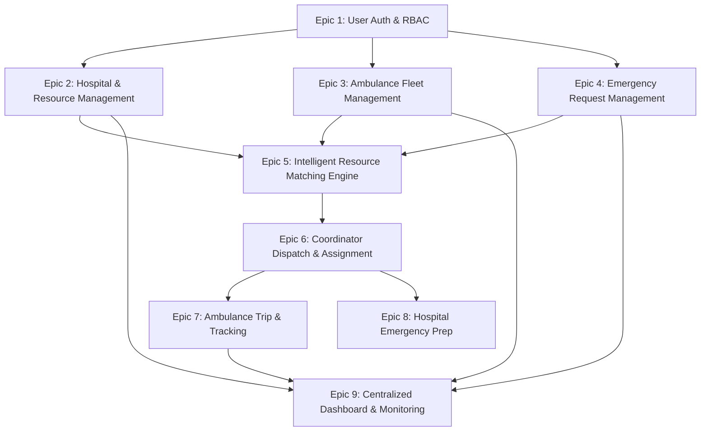

# Statement of Work (SOW)
## Real-Time Healthcare Emergency Resource Coordination System

---

## 1. Project Overview & Scope Description

The **Real-Time Healthcare Emergency Resource Coordination System** is a unified platform designed to manage and streamline emergency medical response. The system coordinates emergency requests, hospital resource availability (beds, ICU, equipment, staff), and ambulance dispatching with simulated GPS tracking, providing end-to-end visibility on a centralized dashboard.

### Core Architecture & User Roles
1. **System Admin**: Manages system entities (Hospitals, Ambulances, Users, Access Permissions).
2. **Hospital Admin**: Continuously updates hospital resource metrics (Beds, ICU, Equipment, Medical Staff) and emergency status.
3. **Emergency Coordinator**: Manages incoming emergency requests, triggers resource matching, and confirms hospital/ambulance assignments.
4. **Ambulance Operator**: Manages ambulance operational status, accepts assigned trips, and executes simulated location tracking.

---

## 2. Epics, User Stories, and Acceptance Criteria

---

### Epic 1: User Authentication & Role-Based Access Control (RBAC)

#### User Story 1.1: Multi-Role Secure Login
**As a** system user (System Admin, Hospital Admin, Emergency Coordinator, Ambulance Operator),  
**I want to** log in securely using my credentials,  
**so that** I am authenticated and directed to my role-specific dashboard.

- **Acceptance Criteria**:
  - **Given** a registered user with valid email/username and password,  
    **When** they submit the login form,  
    **Then** the system authenticates the user, generates a secure JWT token/session, and redirects them to their designated dashboard.
  - **Given** invalid credentials,  
    **When** the login form is submitted,  
    **Then** the system displays a clear error message ("Invalid username or password") and prevents access.
  - **Given** an unauthenticated request to a protected API endpoint,  
    **When** processed by the server,  
    **Then** an HTTP 401 Unauthorized status is returned.

#### User Story 1.2: Role Enforcement & Authorization
**As a** system administrator,  
**I want to** restrict application features based on user roles,  
**so that** users can only view and modify data permitted for their role.

- **Acceptance Criteria**:
  - **Given** a logged-in Hospital Admin,  
    **When** they attempt to navigate to System Admin user management pages,  
    **Then** access is denied with a 403 Forbidden alert.
  - **Given** an Ambulance Operator,  
    **When** they view the application,  
    **Then** they only see options relevant to their assigned ambulance and active trip.

---

### Epic 2: Hospital & Resource Management

#### User Story 2.1: Hospital Entity Registration
**As a** System Admin,  
**I want to** register and manage hospital profiles,  
**so that** hospitals are indexed into the system for resource tracking.

- **Acceptance Criteria**:
  - **Given** hospital details (Name, Location/Address, Contact Info, Initial Status),  
    **When** the System Admin submits the registration form,  
    **Then** a new Hospital record is created with a unique Hospital ID.
  - **Given** an existing hospital profile,  
    **When** the System Admin updates details or deactivates the hospital,  
    **Then** changes are immediately saved and reflected across system queries.

#### User Story 2.2: Live Hospital Resource Inventory Updates
**As a** Hospital Admin,  
**I want to** update bed counts, ICU availability, equipment, and staff on duty,  
**so that** the matching engine operates on current, accurate data.

- **Acceptance Criteria**:
  - **Given** a Hospital Admin on their resource panel,  
    **When** they update Total/Occupied/Available Beds, ICU Beds, Ventilator/Oxygen units, and Available Doctors/Nurses,  
    **Then** the database updates the available quantities and automatically updates the `last_updated_timestamp`.
  - **Given** a resource update (e.g., ICU Available changed from 2 to 1),  
    **When** saved successfully,  
    **Then** the new count is immediately visible on the Central Dashboard and available to the Resource Matching Engine.

#### User Story 2.3: Emergency Department Operational Status
**As a** Hospital Admin,  
**I want to** set the overall status of the Emergency Department (`AVAILABLE`, `BUSY`, `FULL`),  
**so that** coordinators know if the hospital can accept new emergencies.

- **Acceptance Criteria**:
  - **Given** a hospital at full capacity,  
    **When** the Hospital Admin changes status to `FULL`,  
    **Then** the system flags the hospital and excludes it from auto-recommendations unless manually overridden.

---

### Epic 3: Ambulance Fleet Management

#### User Story 3.1: Ambulance Registration & Metadata
**As a** System Admin,  
**I want to** add and configure ambulances in the system,  
**so that** emergency dispatchers have an updated fleet roster.

- **Acceptance Criteria**:
  - **Given** ambulance details (Ambulance ID/Plate, Vehicle Type, Equipment Level, Base Location),  
    **When** submitted by the System Admin,  
    **Then** the ambulance is saved with default status `AVAILABLE`.

#### User Story 3.2: Ambulance Availability Status Management
**As an** Ambulance Operator or System Admin,  
**I want to** view and update the operational availability (`AVAILABLE`, `BUSY`, `MAINTENANCE`),  
**so that** only ready vehicles are dispatched.

- **Acceptance Criteria**:
  - **Given** an ambulance with status `AVAILABLE`,  
    **When** assigned to an emergency,  
    **Then** the system automatically transitions its status to `BUSY`.
  - **Given** an ambulance completing a trip,  
    **When** marked completed,  
    **Then** its status reverts to `AVAILABLE`.

---

### Epic 4: Emergency Request Management

#### User Story 4.1: Emergency Request Creation
**As an** Emergency Coordinator (or Emergency Operator),  
**I want to** create a detailed emergency request during a crisis call,  
**so that** required resources can be calculated and matched.

- **Acceptance Criteria**:
  - **Given** fields (Patient ID/Info, Emergency Type e.g., Road Accident, Location, Priority e.g. CRITICAL/HIGH/MEDIUM, Required Resources e.g., ICU Bed, Ventilator, Emergency Doctor),  
    **When** the coordinator clicks "Create Request",  
    **Then** an Emergency Request is created with status `PENDING` and a unique Request ID (e.g., `ER-1025`).

#### User Story 4.2: Request Lifecycle & Priority Tracking
**As an** Emergency Coordinator,  
**I want to** monitor and filter requests by priority and lifecycle status (`PENDING`, `ASSIGNED`, `IN_PROGRESS`, `COMPLETED`),  
**so that** critical patients receive immediate attention.

- **Acceptance Criteria**:
  - **Given** multiple active requests,  
    **When** viewing the Emergency Request List,  
    **Then** requests are sorted with `CRITICAL` priority at the top, clearly highlighted in red/warning badges.

---

### Epic 5: Intelligent Resource Matching Engine

#### User Story 5.1: Automated Hospital Suitability Matching
**As an** Emergency Coordinator,  
**I want to** run resource matching for a pending emergency request,  
**so that** the system identifies hospitals meeting all patient requirements.

- **Acceptance Criteria**:
  - **Given** an Emergency Request requiring (ICU Bed: 1, Ventilator: 1, Doctor: 1),  
    **When** the matching engine evaluates hospital inventories,  
    **Then** Hospital A (ICU: 1, Vent: 2, Doctor: 6) is flagged as **Suitable**, while Hospital B (ICU: 0) is flagged as **Unsuitable**.
  - **Given** matching results,  
    **When** rendered to the Coordinator,  
    **Then** suitable hospitals are listed with exact resource counts and proximity/status badges.

#### User Story 5.2: Available Ambulance Matching
**As an** Emergency Coordinator,  
**I want to** see real-time available ambulances near the emergency location,  
**so that** I can pick the best transport option.

- **Acceptance Criteria**:
  - **Given** fleet status,  
    **When** request matching is triggered,  
    **Then** all ambulances with status `AVAILABLE` are retrieved and displayed alongside their distance or current location coordinates.

---

### Epic 6: Coordinator Assignment & Workflow Synchronization

#### User Story 6.1: Coordinator Dispatch Confirmation
**As an** Emergency Coordinator,  
**I want to** select a suitable hospital and an available ambulance, then confirm the assignment,  
**so that** emergency teams are dispatched and resources reserved.

- **Acceptance Criteria**:
  - **Given** a pending request, a selected Hospital (e.g., Hospital A), and a selected Ambulance (e.g., A01),  
    **When** the Coordinator clicks "Assign",  
    **Then** in a single atomic transaction:
    1. Emergency Request status changes `PENDING` $\rightarrow$ `ASSIGNED`.
    2. Ambulance status changes `AVAILABLE` $\rightarrow$ `BUSY`.
    3. Selected Hospital resource inventory is updated (e.g., ICU Available decremented or reserved).
    4. An Assignment record linking Request ID, Hospital ID, and Ambulance ID is created.

---

### Epic 7: Ambulance Trip Execution & Simulated GPS Tracking

#### User Story 7.1: Trip Initiation by Operator
**As an** Ambulance Operator,  
**I want to** view my assigned trip details and click "Start Trip",  
**so that** the hospital and coordinator know patient transport has begun.

- **Acceptance Criteria**:
  - **Given** an assigned trip on the Operator's mobile/web view,  
    **When** the Operator clicks "Start Trip",  
    **Then** Emergency Request status updates to `IN_PROGRESS` and the trip timer/route simulation initializes.

#### User Story 7.2: Simulated GPS Movement & Live Tracking
**As an** Emergency Coordinator or System Admin,  
**I want to** view the live simulated movement of dispatched ambulances on a map view,  
**so that** I can track progress in real-time.

- **Acceptance Criteria**:
  - **Given** an active trip with predefined route coordinates (Lat/Lng waypoints),  
    **When** the simulation ticks periodically (e.g., every 3-5 seconds),  
    **Then** the ambulance marker updates position smoothly across coordinates toward the destination hospital.
  - **Given** the arrival at the hospital,  
    **When** the Operator clicks "Complete Trip",  
    **Then** Request status changes to `COMPLETED`, Ambulance status reverts to `AVAILABLE`, and the final timestamp is recorded.

---

### Epic 8: Hospital Emergency Preparation

#### User Story 8.1: Incoming Emergency Queue & Alerting
**As a** Hospital Admin,  
**I want to** view real-time incoming emergencies assigned to my hospital,  
**so that** medical staff and ICU units can prepare before patient arrival.

- **Acceptance Criteria**:
  - **Given** a new assignment confirmed by the Coordinator,  
    **When** Hospital Admin views their "Incoming Emergencies" panel,  
    **Then** an alert pop-up/notification appears showing Request ID, Priority, Patient Requirements (e.g., ICU, Ventilator, Doctor), and ETA/Ambulance ID.

---

### Epic 9: Centralized Dashboard & Real-Time Monitoring

#### User Story 9.1: System-Wide Operational Overview
**As a** System Admin or Authority,  
**I want to** monitor high-level KPIs across hospitals, ambulances, and emergency requests on a single dashboard,  
**so that** I have complete situational awareness.

- **Acceptance Criteria**:
  - **Given** the Central Dashboard,  
    **When** rendered,  
    **Then** it displays:
    - **Hospital Summary**: Total registered, Available vs Busy vs Full counts, Total available beds and ICU units.
    - **Ambulance Summary**: Total fleet size, Available vs Busy counts.
    - **Emergency Summary**: Total emergencies grouped by priority (Critical, High, Medium) and status (Pending, Assigned, In Progress, Completed).
    - **Active Dispatch Table**: Live list of ongoing trips with current request status.

#### User Story 9.2: Low Resource Capacity Alerts
**As a** System Admin or Emergency Coordinator,  
**I want to** receive visual warnings when hospital resources drop below critical thresholds,  
**so that** action can be taken proactively.

- **Acceptance Criteria**:
  - **Given** a hospital where ICU availability reaches 0 or Bed availability drops below 2,  
    **When** the dashboard updates,  
    **Then** a prominent Warning Alert banner is displayed (e.g., "⚠️ Hospital A: ICU Capacity Exhausted").

#### User Story 9.3: Periodic Live Updates & Refresh Mechanism
**As a** user viewing the Central Dashboard,  
**I want to** have data update automatically without manually refreshing the browser,  
**so that** the information is always fresh.

- **Acceptance Criteria**:
  - **Given** open dashboard view,  
    **When** background data changes occur (resource updates, ambulance locations, status changes),  
    **Then** the UI refreshes automatically (polling every 5s or via real-time events) displaying the `Last Updated` timestamp.

---

## 3. Summary Matrix of User Stories & User Roles

| Epic | Story ID | User Story Title | System Admin | Hospital Admin | Coordinator | Ambulance Operator |
|---|---|---|:---:|:---:|:---:|:---:|
| **1. Auth & RBAC** | US-1.1 | Multi-Role Secure Login | ✅ | ✅ | ✅ | ✅ |
| | US-1.2 | Role Enforcement & Authorization | ✅ | ✅ | ✅ | ✅ |
| **2. Hospital** | US-2.1 | Hospital Entity Registration | ✅ | ❌ | ❌ | ❌ |
| | US-2.2 | Live Resource Inventory Updates | ❌ | ✅ | ❌ | ❌ |
| | US-2.3 | Emergency Status Management | ❌ | ✅ | ❌ | ❌ |
| **3. Ambulance** | US-3.1 | Ambulance Registration | ✅ | ❌ | ❌ | ❌ |
| | US-3.2 | Ambulance Availability Status | ✅ | ❌ | ❌ | ✅ |
| **4. Emergency** | US-4.1 | Emergency Request Creation | ❌ | ❌ | ✅ | ❌ |
| | US-4.2 | Request Priority & Lifecycle | ❌ | ❌ | ✅ | ❌ |
| **5. Matching** | US-5.1 | Hospital Resource Matching Engine | ❌ | ❌ | ✅ | ❌ |
| | US-5.2 | Ambulance Distance & Availability | ❌ | ❌ | ✅ | ❌ |
| **6. Assignment** | US-6.1 | Dispatch Assignment Confirmation | ❌ | ❌ | ✅ | ❌ |
| **7. Tracking** | US-7.1 | Trip Initiation & Status Updates | ❌ | ❌ | ❌ | ✅ |
| | US-7.2 | Simulated GPS Tracking & Map | ✅ | ❌ | ✅ | ✅ |
| **8. Prep** | US-8.1 | Incoming Emergency Notifications | ❌ | ✅ | ❌ | ❌ |
| **9. Dashboard** | US-9.1 | Centralized KPI Dashboard | ✅ | ✅ | ✅ | ❌ |
| | US-9.2 | Resource Capacity Alert Banners | ✅ | ✅ | ✅ | ❌ |
| | US-9.3 | Live Data Refresh & Timestamps | ✅ | ✅ | ✅ | ✅ |

---
